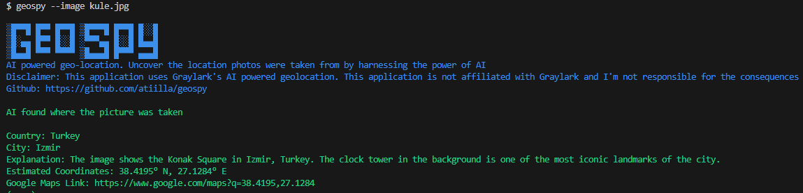

# geospy


AI-powered geo-location tool to uncover the location where photos were taken.



## Installation

```bash
pip install geospyer
```

## Usage

```bash
geospyer --image path/to/your/image.jpg
```

Replace path/to/your/image.jpg with the actual path to the image you want to analyze.

## Features

- AI-powered geo-location using Graylark's API.
- Generate Google Maps links based on image coordinates.

## Disclaimer

This application uses Graylark's AI-powered geolocation. It is not affiliated with Graylark, and the author is not responsible for the consequences of using this application.

## Contributing

1. Fork the repository
2. Create a new branch (git checkout -b feature/new-feature).
3. Commit your changes (git commit -am 'Add new feature').
4. Push to the branch (git push origin feature/new-feature).
5. Create a pull request.

## License

This project is licensed under the MIT License - see the LICENSE file for details.

## Acknowledgments

- [Thanks to Graylark](https://graylark.io/) for providing the AI-powered geolocation service.
